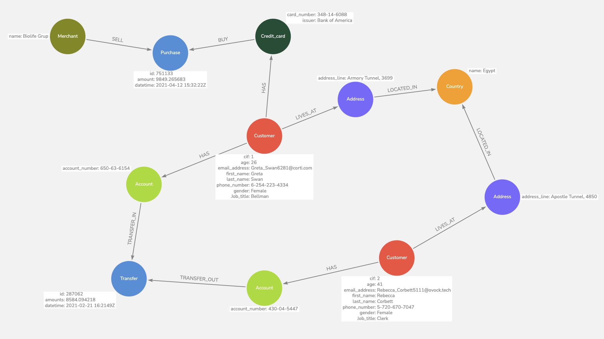

# Banking Transactions Analysis

## Running Neo4j Enterprise on Docker

Use the following command to run Neo4j Enterprise on Docker. Update the volume paths for Neo4j's data and logs folders accordingly.

```
docker run \
    --env=NEO4J_ACCEPT_LICENSE_AGREEMENT=yes \
    --restart always \
    --publish=7474:7474 --publish=7687:7687 \
    --volume=/path/to/data/folder:/data \
    --volume=/path/to/log/folder:/logs \
    neo4j:5.8.0-enterprise
```

Once the container is running, open the following link on your browser to see the Neo4j Browser:

```
http://localhost:7474
```
## Datasets used

This project uses datasets from [banking - Customer & Transaction data](https://gist.github.com/maruthiprithivi/f11bf40b558879aca0c30ce76e7dec98). For simplicity, the datasets are also included in this repo:

  - [customers.csv](./datasets/customers.csv)
  - [purchases.csv](./datasets/purchases.csv)
  - [transfers.csv](./datasets/transfers.csv)


## Data Model

The data is modeled using [arrows.app](https://arrows.app/), which is available in JSON format([Bank_transaction_purchase.json](./Bank_transaction_purchase.json)).

The following image illustrates it:



## Loading the data into Neo4j

This project uses Python to cleanse and load the data. The script is written as a Jupyter Notebook ([banking_ingestion.ipynb](./banking_ingestion.ipynb)) to make it easier to follow. Please use [Nbviewer](https://nbviewer.org/github/wicaksana/neo4j-banking-transactions-analysis/blob/main/banking_ingestion.ipynb) to open the notebook in case Github fails to render it.

Environment specification:

- Python version: 3.10.9
- Package `neo4j` version: 5.9.0
- Pandas version: 1.5.3

## Exploratory Cypher queries

### Most valuable merchants

```sql
MATCH (t:Purchase)<-[:SELL]-(m:Merchant)
RETURN m.name, SUM(t.amount) AS total
ORDER BY SUM(t.amount) DESC
LIMIT 10
```

Result:

```
╒══════════════════╤══════════════════╕
│m.name            │total             │
╞══════════════════╪══════════════════╡
│"It Smart Group"  │3769957.383542169 │
├──────────────────┼──────────────────┤
│"Areon Impex"     │3583469.9180520033│
├──────────────────┼──────────────────┤
│"21st Century Fox"│3572767.081992541 │
├──────────────────┼──────────────────┤
│"Vodafone"        │3566854.7667955994│
├──────────────────┼──────────────────┤
│"Amazon.com"      │3540095.287769094 │
├──────────────────┼──────────────────┤
│"Demaco"          │3524523.1630317084│
├──────────────────┼──────────────────┤
│"Facebook"        │3517539.635354998 │
├──────────────────┼──────────────────┤
│"Zepter"          │3490776.4376936606│
├──────────────────┼──────────────────┤
│"ExxonMobil"      │3483800.2829920193│
├──────────────────┼──────────────────┤
│"Metro Cash&Carry"│3457534.249150458 │
└──────────────────┴──────────────────┘
```

### Customers with the most credit card transactions

```sql
MATCH (c:Customer)-[:HAS]->(cc:Credit_card)-[:BUY]->(p:Purchase)
RETURN 
    c.first_name + ' ' + c.last_name AS name,
    COUNT(p) AS total_purchase,
    SUM(p.amount) AS total_amount
ORDER BY COUNT(p) DESC 
LIMIT 10
```

Result:

```
╒═════════════════╤══════════════╤══════════════════╕
│name             │total_purchase│total_amount      │
╞═════════════════╪══════════════╪══════════════════╡
│"Dani Flanders"  │179           │1882640.2654660696│
├─────────────────┼──────────────┼──────────────────┤
│"Greta Swan"     │179           │1978438.3806692604│
├─────────────────┼──────────────┼──────────────────┤
│"Mark Jobson"    │179           │1740844.7296802902│
├─────────────────┼──────────────┼──────────────────┤
│"Janice Simmons" │178           │1680983.5578798803│
├─────────────────┼──────────────┼──────────────────┤
│"Candace Shea"   │178           │1814280.138332621 │
├─────────────────┼──────────────┼──────────────────┤
│"Matt Carter"    │178           │1801833.8113858304│
├─────────────────┼──────────────┼──────────────────┤
│"Hayden Garcia"  │177           │1756431.3128474005│
├─────────────────┼──────────────┼──────────────────┤
│"Rebecca Corbett"│177           │1763501.33452983  │
├─────────────────┼──────────────┼──────────────────┤
│"Rowan Harper"   │177           │1763699.88887497  │
├─────────────────┼──────────────┼──────────────────┤
│"Morgan James"   │177           │1742265.338604869 │
└─────────────────┴──────────────┴──────────────────┘
```

### Merchant recommendation for customers with similar purchase behavior

TBA.